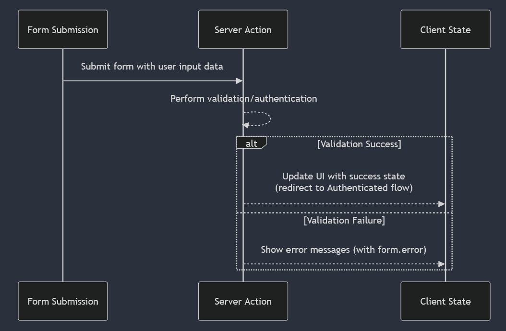

# Introduction
This project was bootstrapped with the [Epic Stack](https://github.com/epicweb-dev/epic-stack). It is my attempt to learn the full development cycle, and it also serves as a component for my résumé.

## How it works
More often than not, a Remix route module can contain both the UI and the interactions with the models (data entities in the database) in the same file, which leads to seamless developer ergonomics and productivity.

Route modules have three primary exports: 
1. `loader`: for server-side data loading to provide data to your component on GET requests.
2. `action`: for data mutations. It only runs on the server and handle `POST`, `PUT`, `PATCH`, and `DELETE` requests to provide data to your component.
3. `default`: the React component that runs both on the server and the client. It will be rendered when a route matches the URL.

Checkout the Remix [route convention](https://remix.run/docs/en/main/discussion/routes#conventional-route-folders) and [remix-flat-routes](https://github.com/kiliman/remix-flat-routes) to understand how routing works.

### Example
Let's see how Remix serves as a fullstack framework by describing what's going on when you click on the "Log In" button on the app's header:

The server-client data flow is defined in the `app/routes/_auth+/login.tsx` file. You can see that:
- The `loader` function prepares data for initial render
- The `action` function handles form submissions
- The `LoginPage` component uses both `loader` and `action` data to render UI and manage state
- All server-client communication happens through standard HTTP methods (GET/POST)
- Session state is maintained via cookies

Form submission flow:

State management flow:

# Installation
If you want to run the app locally, make sure to have the same environment as I do to get it working properly. Please download and install these 2 softwares (if you don't have them already):
1.  **nvm-setup.zip** from its [latest release](https://github.com/coreybutler/nvm-windows/releases)
2.  [Git](https://git-scm.com/downloads)

Then open up your terminal with **Admin privilege** and run the following commands:
1. `nvm install 22.13.0` 
2. `nvm use 22.13.0` 
3. `node -v` (the output should be `v22.13.0`)
4. Pick a folder of your choice, or create an empty folder and then `cd path-to-that-folder`
5. `git clone https://github.com/HelpMe-Pls/Fullstack-notes.git`
6. `cd Fullstack-notes`

## Available Scripts
In the project directory, you can run:

### `npm i`
Installs all required dependencies to run the app.

### `npm run setup`
Prepares the database so that the backend can start properly.

### `npm run dev`
Runs the app in the development mode.\
Open [http://localhost:3000](http://localhost:3000) to view it in the browser.

The page will reload if you make edits in your code and save.\
You will also see any lint errors in the console.

### `npm run test`
Runs unit tests using [Vitest](https://vitest.dev/guide) in the interactive watch mode.\
Test files are identified by the `.test.ts` or `.test.tsx` extensions and are located in the `app/routes` and `app/utils` folders.

### `npm run coverage`
Runs _all_ tests once (not in watch mode) and generates a coverage report using the [Vitest's](https://vitest.dev/guide/coverage#coverage-setup) built-in coverage reporting.\
It shows which parts of your code are covered by tests.

### `npm run test:e2e:run`
Runs end-to-end tests using Playwright. Test files are located in the `./tests/e2e` folder.\
You must run the `npm run build` or `npm run pretest:e2e:run` and stop your dev server _before_ running this command.  

### `npm run build`
Builds the app for production to the `build` folder.\
It runs all build scripts sequentially by using the `run-s` command from the `npm-run-all` package.

Once the `build` folder is created, you can run the app locally in production mode with the `npm start` command.

# Deployment
According to the [documentation](https://github.com/epicweb-dev/epic-stack/blob/main/docs/deployment.md#deploying-to-flyio), you can also deploy to Fly.io. Notice that there's a trial period for using their services.

For the purpose of learning the fullstack development cycle, deploying with a Docker image is an essential skill to have.

# Scaling
If you're running a single instance, LiteFS (configured in Dockerfile) will still work but won't be replicating data (since Docker volume is sufficient).

If you later decide to scale to multiple instances, having LiteFS already configured (in the `other/litefs.yml` file) will make the transition easier.

# Documentation
To *quickly* learn React for free, check out the [React documentation](https://react.dev/learn).\
For a paid course, I highly recommend [The Joy of React](https://www.joyofreact.com) course.\
My personal preference of a [learning path](https://www.reactiflux.com/learning) to become a React Frontend developer.

Checkout the [reasons](https://remix.run/docs/en/main/discussion/introduction) why I chose Remix as a framework to learn about fullstack development.

# Contributing
Pull requests are most welcome. For breaking changes suggestion, please open an issue first to discuss what you would like to change or improve.

[Contact me](https://www.facebook.com/messages/t/100005341874318) if you need further support.